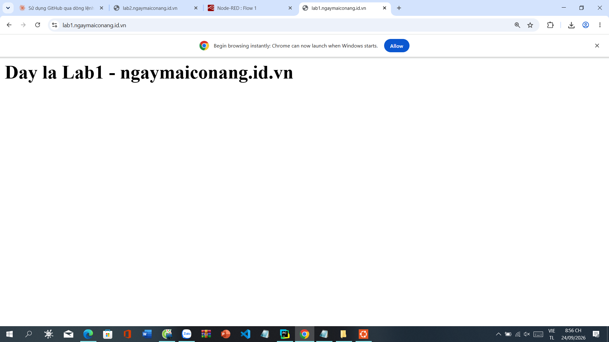
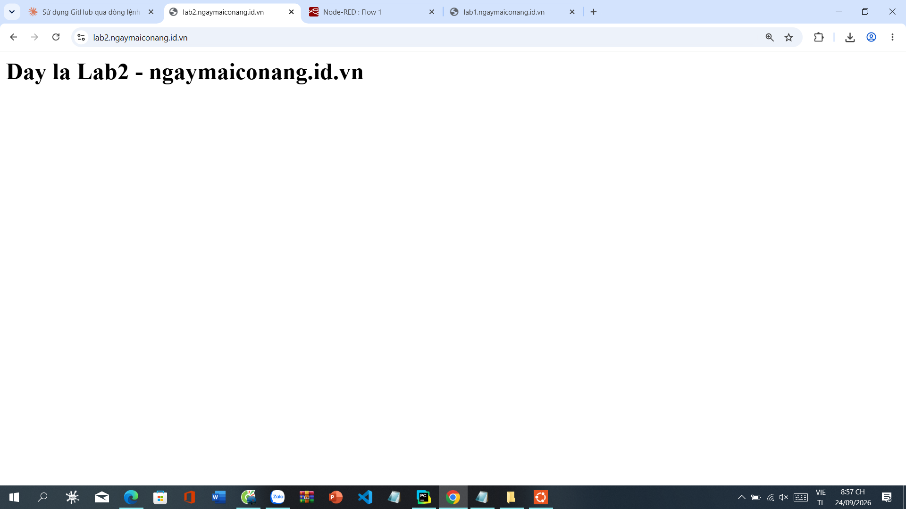
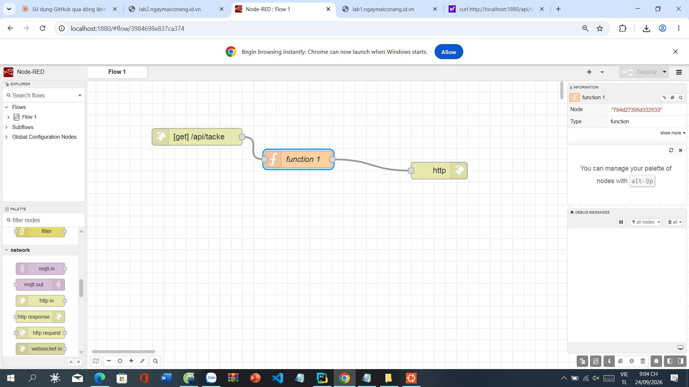
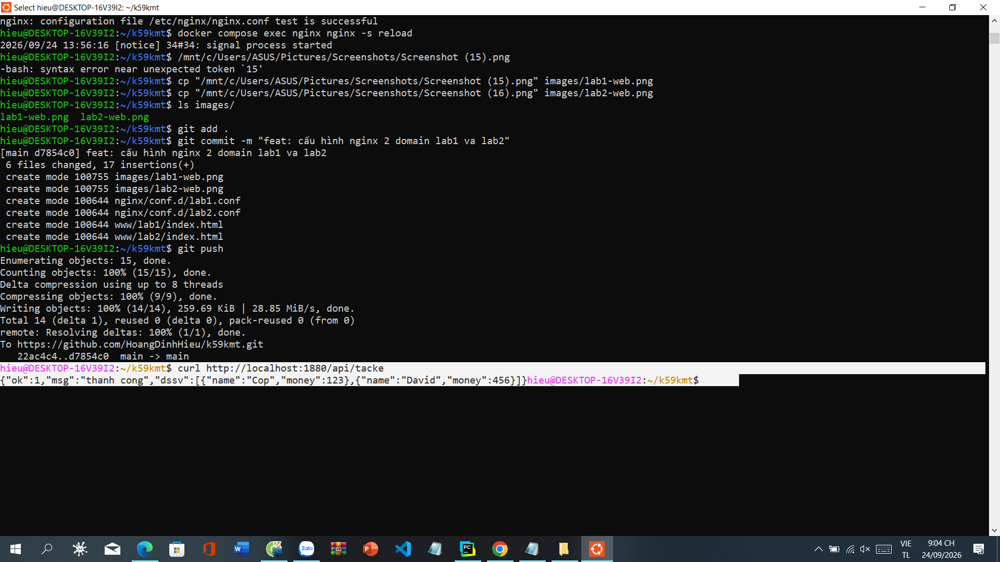
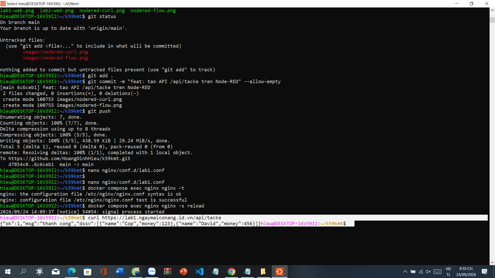
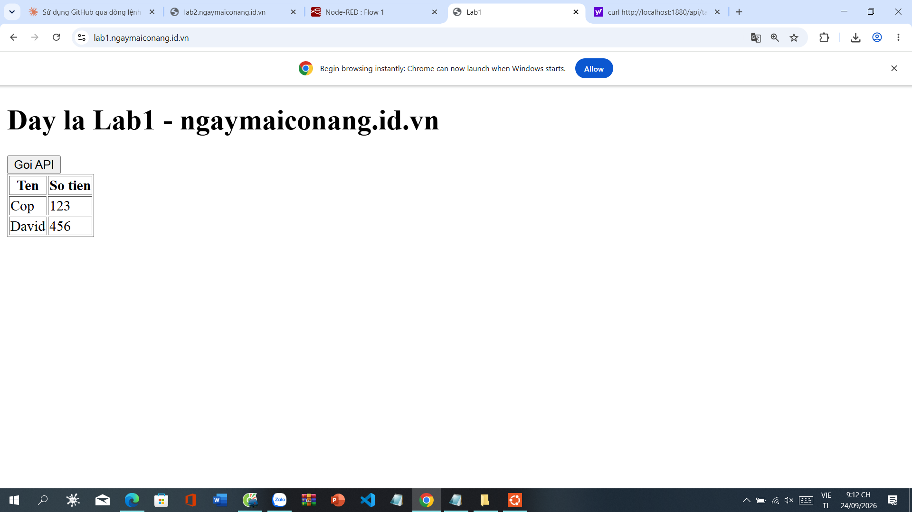

# Bài tập Lập trình Web - K59KMT

## Yêu cầu
- Cài đặt môi trường Linux (WSL Ubuntu) và Docker Compose
- Triển khai 5 dịch vụ: Nginx, Node-RED, MariaDB, phpMyAdmin, Cloudflared
- Cấu hình Nginx phục vụ 2 domain riêng biệt: lab1 và lab2
- Xây dựng API trên Node-RED, cấu hình proxy qua Nginx
- Viết JavaScript gọi API và hiển thị dữ liệu trên trang HTML
- Public ra internet bằng Cloudflare Tunnel với domain thật

## Deadline
(Deadline: 30/09/2026 23:59)

## Sinh Viên:
Hoàng Đình Hiếu

## Kết quả dự kiến
- `https://lab1.ngaymaiconang.id.vn` và `https://lab2.ngaymaiconang.id.vn` chạy được
- API `/api/tacke` trên Node-RED trả về đúng dữ liệu JSON
- Nginx proxy `/api/` hoạt động qua domain thật
- Trang lab1 gọi API bằng JavaScript và hiển thị bảng dữ liệu

---

## Nhật ký thực hiện (7 commit)

### 1. `docs: khoi tao repo, xac nhan da cai WSL Ubuntu`
Khởi tạo repo, xác nhận đã cài WSL Ubuntu.

### 2. `chore: da cai dat Docker + Docker Compose`
Cài đặt Docker và Docker Compose trên WSL Ubuntu.

### 3. `feat: tao cau truc thu muc va docker-compose.yml cho 5 dich vu`
Tạo cấu trúc thư mục và file `docker-compose.yml` khai báo 5 dịch vụ: nginx, nodered, mariadb, phpmyadmin, cloudflared.

### 4. `feat: cau hinh nginx 2 domain lab1 va lab2, them anh minh chung`
Cấu hình Nginx phục vụ 2 domain riêng biệt qua Cloudflare Tunnel.

### 5. `feat: tao API /api/tacke tren Node-RED, them anh minh chung`
Tạo API `/api/tacke` trên Node-RED (http in → function → http response).

### 6. `feat: them proxy /api/ tren nginx lab1 toi nodered`
Cấu hình Nginx proxy `/api/` từ domain thật tới Node-RED.

### 7. `feat: hoan thanh JS goi API va hien thi du lieu, them anh minh chung`
Viết JavaScript trong trang HTML gọi API và hiển thị bảng dữ liệu.

